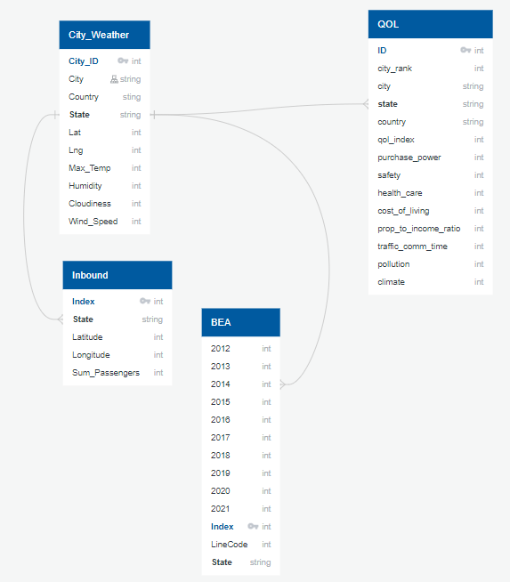

## Project Overview

The objective of the final project was to use Machine Learning to validate the chosen datasets and to choose various program languages to produce a presentation in order to show the skills learned throughout the UCF Data Analysis and Visualization Bootcamp. 

With this is mind this is the presentation chosen by the Final CountGroup.

Final CountGroup Consulting was engaged to conduct research and provide analysis to a AirBnb serial investor and their board of directors to explore the theme of business investment, weather analysis, travel destinations, government outdoor spending, and quality of life.

## Data Process
To conduct our analysis, our team sought out relevant data sources. We utilized websites such as Kaggle.com and Dataworld.com and conducted keyword searches on Tableau Public. Additionally, each team member conducted searches on ChatGPT and Google. As a result of these efforts, we were able to gather multiple datasets that allowed us to conduct our analysis. 

During the data research process, it was important to have a clear understanding of what we were looking for. While we began with a general idea of the data we needed, we also had to be careful not to get sidetracked by irrelevant information. In some instances, we found ourselves exploring data and ideas that ultimately helped to refine our research questions and narrow down the specific data needed to provide valuable analysis for our client.

## Database

The final project data is stored here: https://github.com/jakatz87/Final_Group_Project/tree/main/final_project_data

## Data Refernece

Average Temperature by State  
Data File: cities_weather_data_cleaned_us_only.csv  
Data Source:Openweather.org  

Inbound Travelers by State per Million  
Data File: inbound_data_cross_reference.csv  
Data Source: US_Air_Travel by Robby Sim (Tableau Public data download)  

Real Estate Buyers by State %  
Data File: nar_share_of_homebuyers.csv  
Data Source: National Association of Realtors  

US Quality of Life  
Data File: qol_cleaned_us_only.csv  
Data Source: Numbeo.com Northern America: Current Quality of Life Index by City  

Median Government Outdoor Spending  
Data File: ml_data.csv  
Data Source: merged data from various sources. See Machine Learning References for details  

Data File: outdoor_rec_BEA_data_pulls.csv  
Data Source: US. Department of Commerce Bureau of Economic Analysis (bea)  

Machine Learning References  
Data File: ml_data.csv  
Data Source: merged data from the following data file; nar_share_of_homebuyers.csv, outdoor_rec_BEA_data_pulls.csv, cities_weather_data_cleaned_us_only.csv, inbound_data_cross_reference.csv, qol_cleaned_us_only.csv   

## Questions for Analysis

What metrics would influence a potential a serial AirBnb investor to buy a vacation rental property?

Would factors such as weather, travelers, cost of living, healthcare, safety, quality of life or property inventory play a role in where a person decides to purchase a vacation rental property?

## Analysis

### Machine Learning

Machine learning is a powerful tool used to interpret data by creating algorithms that can learn from patterns and trends within the data. The process involves feeding large sets of data into a machine learning model, which then identifies patterns and relationships within the data, and uses that information to make predictions or classifications for new data. 

We had data on weather, on quality of life, on government spending, and travel destinations, we just had to create a model.  So, we decided to create an arbitrary percentile for quality of life, and gave each city a 1 or a 0 based on it.

Once the ‘high_q’ measure was created, we accounted for overfitting by dropping the features that would be far too obvious for a ML model, like the quality-of-life index and the city_rank. 

We created both a Logistic Regression Model and a Random Forest Model.  The Random Forest Model worked way too well, with 100% accuracy.  So, we dropped more features and n_estimators, but still came back at 100%.  

The Random Forest Model helped us refine which features had the highest impact in our analysis

The Logistic Regression Model had a 98% accuracy, so we had a good idea our data was valid enough. 

A couple of issues surfaced: the quality-of-life measures were merged by state, so we dropped the raw quality of life index measure as a feature.  The government expenses were flat amounts, not per capita, so the hope was StandardScalar would account for that.

Regardless of which model was more accurate, the beauty was in the Feature Importances measure.  It turns out that the features with the highest impact were Safety, Healthcare, and Government Expenses on Outdoor Activities (including travel and tourism).  Keep that in mind when looking to invest in rental properties.
 
 

## Visualizations
Our aim was to assist our client in selecting an ideal location for investing in vacation rental property, and we employed Tableau to create interactive maps and graphs for this purpose. Each visualization presents various factors, and by utilizing all the visuals, the investor can decide on the best location for their vacation property investment based on their specific criteria.

This presentation serves as the first in a series of meetings to help our client narrow down their preferred investment locations. The graphics provided are organized by state, enabling the investor to determine which state(s) they are considering investing in. Once the investor has made their initial selection, our team will collect more detailed data and follow the same approach used in the first meeting. Depending on the level of granularity of the data obtained, we may be able to significantly narrow down the location options.

Average Temperature by State interactive map allows the AirBnb investor to hover over any state and see what the average temperature of a particular state.

Inbound Travelers by State will help inform the investor where people tend to vacation and how rentable a property may be. This interactive visual using dynamic circles allows the user to get a quick view the differing amounts of inbound travelers. In addition, it allows the user to hover over the circle to see the exact number of travelers.

Real Estate Buyers by State interactive graphic gives the client the ability the quickly see overview of the what real estate inventory would be available. It allows the client to hover over each bar and see the actual percentage of buyers for a particular state.

US Quality of Life includes what factors impact the quality of life. By using machine learning tool, we were able to determine the top factors that impact quality of life and overall quality of life rating.  This interactive graphic show which state or states has the optimum quality of life based on the investor’s needs.

Median Government Outdoor Spending stunningly show how much money is spent on outdoor activities. This is a potential indicator of the amount and type of outdoor activities would be available to a potential renter.

## Github/Communication Protocols

To facilitate collaboration, our team created a GitHub repository for our final project, with Josh Katz serving as the repository manager. The repository consists of four branches, one for each team member, and is located within the Final_Count_Group_Consulting repository (https://github.com/jakatz87/Final_Group_Project)
In addition to GitHub, we also established a Slack channel named final-countgroup, which includes all four members of our team. This channel serves as a platform for sharing ideas and notifying the team when we have made updates to our repository. We will also be utilizing Google Meet for video conferencing, with meetings scheduled for a minimum of three times per week. These meetings will occur twice a week during class time on Mondays and Wednesdays from 7pm-9pm, and at least once a week via Google Meet.

## Project Sources
  * Machine Learning
  * HTML
  * CSS
  * JS
  * CSV Files
  * Webscaping
  * API

## Location of Project Deliverables

Presentation: All the website files and final presentation.

The possible final project data is stored here: https://github.com/jakatz87/Final_Group_Project/tree/main/possible_data_files  
The final project data is stored here: https://github.com/jakatz87/Final_Group_Project/tree/main/final_project_data

Final_project_data: All the final csv file

Jupyter Code Files. Code: All the notebooks and Tableau’s used for the final project

## Project Team
  * Joshua Katz
  * Aliana Robertson
  * Scott McCraney
  * Deborah Brashears

